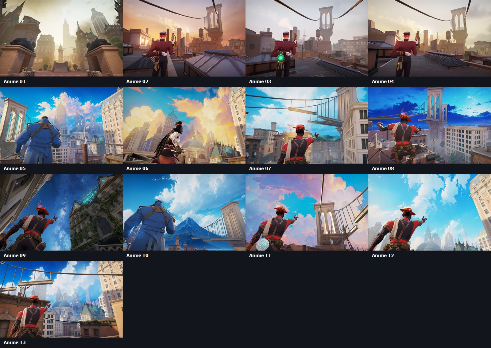
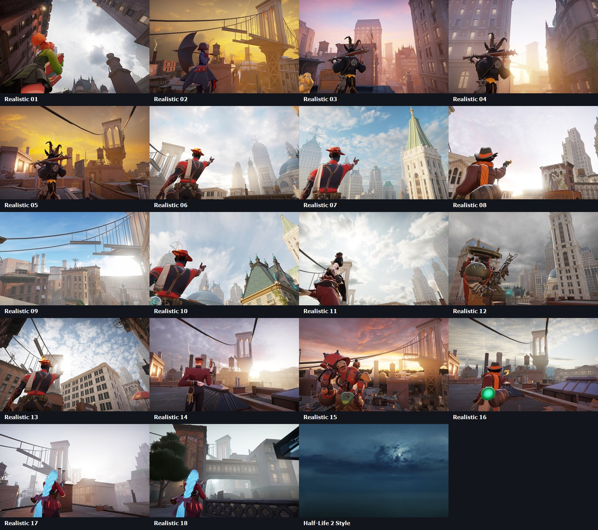

# Deadlock Skybox Selector

### 32 skies. One clean selector.

A polished one-file Windows application for changing the atmosphere of Deadlock safely and restoring Vanilla at any time.

  
  
  
  

 

[**Download the latest release**](https://github.com/harritoncloud/deadlock-skybox-selector/releases/latest) &middot; [View all skyboxes](#skybox-library) &middot; [Read the safety model](#safety-model)

---

## Highlights

| Feature | Behavior |
| --- | --- |
| Native fixed-size GUI | Custom Deadlock-inspired interface with animated cards and high-refresh smooth scrolling. |
| 32 named skyboxes | Every card uses its current atmosphere name and a matching preview. |
| In-place switching | **Apply** changes the selected skybox without restarting the application. |
| Safe override | Unknown skybox mods are verified, backed up, and then replaced transactionally. |
| Vanilla restore | **Restore** removes only the managed override and leaves unrelated addons untouched. |
| Clean first run | Consent and loading screens prepare the local library without showing a console window. |
| Optional FPS profile | A managed block is added to `autoexec.cfg`, preserving existing user settings. |
| GameInfo component | Mounts `citadel/addons`, keeps client physics enabled, and creates a verified backup. |

The window can be moved from any non-interactive surface, and the greeting automatically uses the current Windows account name.

## Quick Start

1. Download `SkyboxSelector.exe` from [Releases](https://github.com/harritoncloud/deadlock-skybox-selector/releases/latest).
2. Close Deadlock and any Deadlock mod manager.
3. Run the selector and approve Windows elevation if Deadlock is installed under `Program Files`.
4. Approve the first-run library installation.
5. Select a skybox card and press **Apply**.
6. Press **Restore** whenever you want to return to the original Deadlock skybox.

The verified library is stored in `<Deadlock>/dlskybox`. Older `deadlockcustomskybox` and `patchwin.cc-skyboxes` caches are migrated automatically.

## Skybox Library

The application presents a single unified library. These are the current names shown on the cards:

| # | Skybox | # | Skybox |
| ---: | --- | ---: | --- |
| 01 | Golden Citadel | 17 | Morning Glow |
| 02 | Amber Rooftops | 18 | Golden Hour |
| 03 | Quiet Morning | 19 | White Haze |
| 04 | Soft Sunrise | 20 | Cloudbreak |
| 05 | Azure City | 21 | Pale Noon |
| 06 | Golden Clouds | 22 | Clear Day |
| 07 | Clear Horizon | 23 | High Clouds |
| 08 | Blue Evening | 24 | Storm Light |
| 09 | Starlit Night | 25 | Grey Front |
| 10 | Mountain Air | 26 | Blue Skies |
| 11 | Cotton Candy | 27 | Rainy Sunset |
| 12 | Crystal Sky | 28 | Ember Sunset |
| 13 | Bright Downtown | 29 | Fading Day |
| 14 | Silver Overcast | 30 | City Mist |
| 15 | Burnished Gold | 31 | Deep Fog |
| 16 | Rose Dusk | 32 | Nightlock |

### Preview Sheet 01

Golden Citadel through Bright Downtown.

### Preview Sheet 02

Silver Overcast through Nightlock.

## Optional FPS Profile

The FPS button manages only its own marked block inside `autoexec.cfg`. Existing settings are preserved, a backup is created before replacement, and empty or missing config files are supported.

Client physics remains enabled. The included profile keeps `cl_ragdoll_limit "8"` without forcing `cl_phys_enabled` off.

## Safety Model

| Protection | Implementation |
| --- | --- |
| Asset integrity | The embedded archive, runtime helpers, and all 32 VPK files are checked with SHA-256. |
| Path confinement | Cache, backup, and addon operations are restricted to validated child paths. |
| Transactional switching | Sources are verified before copying; failed changes roll back to the previous verified file. |
| Unknown-mod preservation | An unfamiliar `pak01_dir.vpk` receives a verified timestamped backup before override. |
| Process guard | Skybox and GameInfo changes are blocked while Deadlock or supported mod managers are running. |
| Cache recovery | Invalid caches are quarantined under an `.invalid-*` name rather than deleted. |
| Config preservation | The FPS profile owns only its marked block and leaves all other `autoexec.cfg` content intact. |

The selector does not launch Deadlock and does not remain active after its window is closed.

## Repository Contents

| Path | Purpose |
| --- | --- |
| `source/launcher` | WinForms interface, one-file launcher, manifest, and application icon. |
| `source/gameinfo-installer` | Permission-aware GameInfo component. |
| `source/runtime` | Skybox transactions, optional FPS profile, and compatibility wrapper. |
| `source/config` | Verified GameInfo payload. |
| `unpacked/runtime` | Runtime resources extracted from the release executable. |
| `unpacked/assets` | All previews, manifests, and 32 unpacked VPK files. |
| `unpacked/config` | GameInfo extracted from the embedded component. |
| `tests` | First-run, switching, rollback, backup, startup, and FPS-profile tests. |
| `tools` | Integrity and synthetic test utilities. |

## Credits

Skybox assets are based on **HyperLine's Skybox Replacement v2.0** for Deadlock. Package inspection and VPK validation use **ValveResourceFormat / Source 2 Viewer**. See [CREDITS.md](./CREDITS.md) for attribution.

The skybox assets are third-party mod content. Confirm redistribution permission before publishing mirrors or derivative packages.

---

Made by **harriton**

