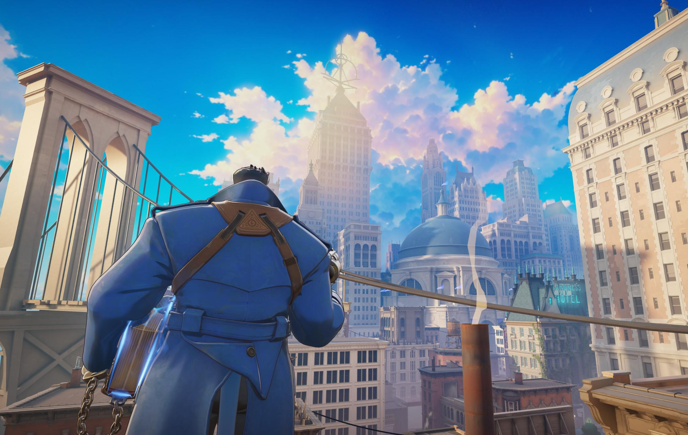
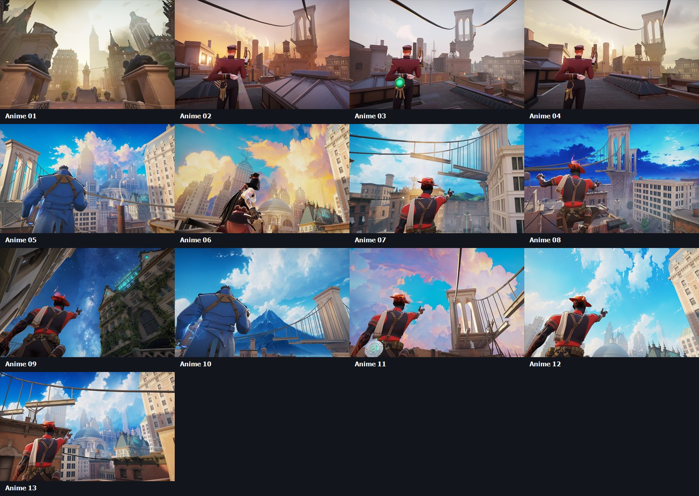
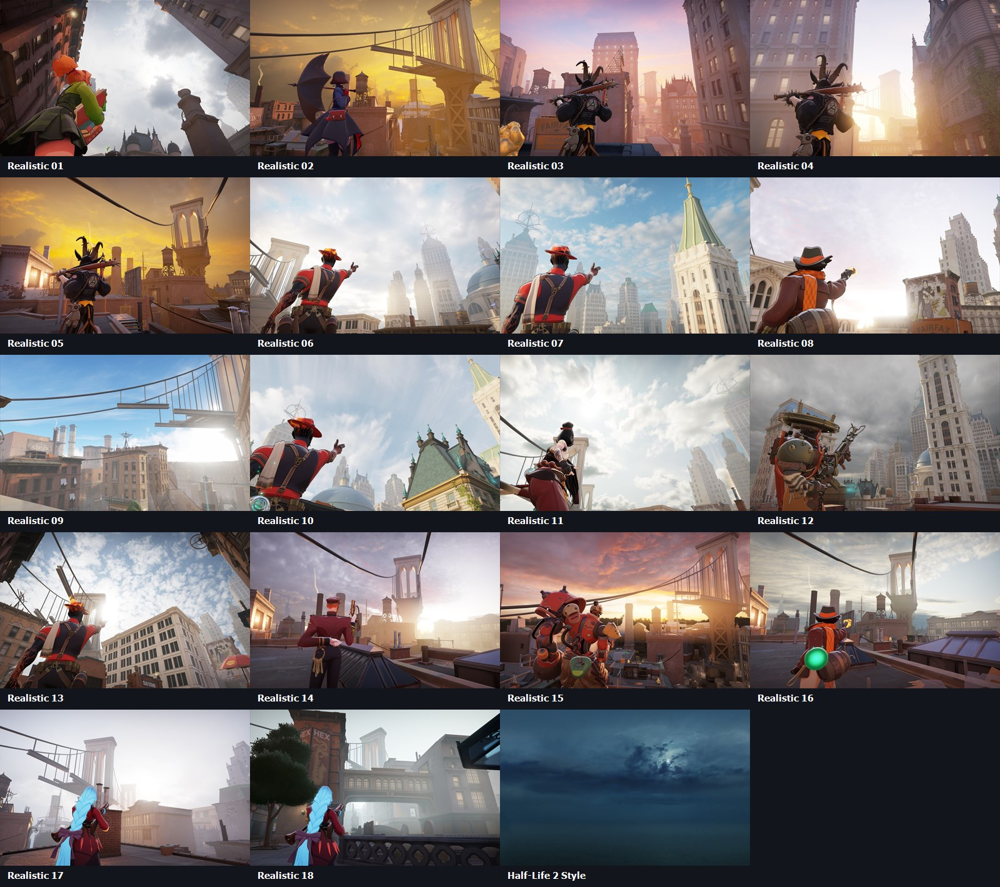

# Deadlock Skybox Selector

### 32 skies. Nine visual fixes. One Windows app.

A one-file selector for Deadlock skyboxes, optional visual fixes, and a saved GameInfo preset. Switch skies in the app; return to the vanilla skybox whenever you want.

  
  
  
  

 

[**Download for Windows**](https://github.com/harritoncloud/deadlock-skybox-selector/releases/latest) &middot; [What's new in 1.2](#whats-new-in-12) &middot; [Browse the skies](#skybox-library)

---

## What's new in 1.2

The selector now brings the skyboxes and the visual tweaks together in one place:

| Area | Update |
| --- | --- |
| Cleaner world | Hide the base veil, factory smoke, pickup-book effect, in-world names and markers, or Graves' summon markers separately. |
| Clearer HUD | Remove HP-bar tick marks; restore purple ability upgrades and legible checkmarks. Build-recommended upgrades now stand out in amber. |
| Softer picture | Toggle **ColorFix** to lower scene contrast without recoloring the HUD. |
| Simpler controls | The redesigned **Fixes** page uses on/off switches; the **GameInfo** page can reapply its saved preset at any time. |
| Pickup-panel repair | The bundled preset no longer forces `citadel_in_world_item_panel_dpi 0`; a local in-game test confirmed that the white square above pickups disappeared. |

The original skybox library remains: 32 named choices with previews, in-app **Apply** and **Restore**, and verified backups when an unknown skybox override must be replaced. The native WinForms interface also has animated cards, smooth scrolling, and a first-run setup without a console window.

The window can be moved from any non-interactive surface, and the greeting automatically uses the current Windows account name.

## Quick Start

1. Download `SkyboxSelector.exe` from [Releases](https://github.com/harritoncloud/deadlock-skybox-selector/releases/latest).
2. Close Deadlock and any Deadlock mod manager.
3. Run the selector and approve Windows elevation if Deadlock is installed under `Program Files`.
4. Approve the first-run library and required GameInfo setup if prompted.
5. Select a skybox card and press **Apply**.
6. Use **Fixes** for optional visual tweaks. Press **Restore** on the skybox page to return to the original Deadlock skybox.

First-run setup installs the bundled GameInfo file if the game lacks the addon mount needed for skyboxes and fixes. Read [GameInfo preset](#gameinfo-preset) for its settings and caveats; **Apply Config** can reapply the same snapshot later.

## Visual Fixes

Each switch is independent. Close Deadlock before changing it; the result appears on the next launch. If an addon slot belongs to another mod, the selector reports the conflict instead of replacing that file.

| Switch | Effect | Addon slot |
| --- | --- | --- |
| Base Veil | Hides the large team-colored clouds above the bases, not gameplay fog or the selected skybox. | `pak03` |
| Factory Smoke | Hides the large black cloud above the factory. | `pak04` |
| Unit Names | Hides floating labels over heroes and other units while keeping their health bars. | `pak05` |
| Pickup Book | Hides the brief floating model after collecting a bonus; the pickup, reward, beam, and glow remain. | `pak06` |
| Player Markers | Hides in-world player names, portraits, and distances without changing the minimap. | `pak07` |
| Graves Markers | Hides distance icons for Graves' zombies and ultimate gravestone, without removing normal pings. | `pak07` |
| HP Bar Lines | Hides the large and small tick marks inside your health bar, not its fill or numbers. | `pak08` |
| Classic Ability Fill | Restores purple upgrade fills, lavender checkmarks and AP color; makes build recommendations amber. | `pak09` |
| ColorFix | Softens scene contrast through post-processing while leaving the HUD unchanged. | `pak10` |

**A couple of details:** Player and Graves markers share one `pak07_dir.vpk` slot; the app installs the player-only, Graves-only, or combined override to keep both switches independent. Unit Names is based on the [Hide Names mod](https://gamebanana.com/mods/722348) and does not remove names printed on map geometry. Pickup Book uses a model shared by several gained-effect pickups, so their brief floating models may disappear too.

Classic Ability Fill also updates the upgrade hint, ability icon, and tooltip-card borders. The amber build recommendation is a visual highlight only; it does not change your build or upgrade state. Switch it off to restore the game's current colors.

## GameInfo Preset

The **GameInfo** page contains a saved, performance-oriented `gameinfo.gi` based on Sqooky's OptimizationLock Maxfps v1.0 ([view the exact file](./source/config/gameinfo.gi)). First-run setup installs this file when the game is missing the `citadel/addons` mount point. **Apply Config** replaces the current game file with the same snapshot and makes a timestamped backup first. You can reapply it even if the snapshot is already installed. There is no Restore button for GameInfo in the interface; its backups stay beside the game file.

This snapshot keeps the user's low-texture assignments, `r_aspectratio 2.5`, and the disabled survey. It leaves `citadel_in_world_item_panel_dpi` at the game's default; that specific change was confirmed to remove the white pickup square in-game. The earlier `BindlessParticleShader 1` override is absent too, but removing it alone did **not** fix the square. The preset's SHA-256 is `CE91F9C6A1CCD7E1A723CFEA27050869D80118B7D1DDC2D049A9217556FAA972`.

> **Important:** This preset sets `cl_phys_enabled false`, which can cause game issues. Some texture and camera commands have not been confirmed to work after the game update, so this is not an FPS guarantee. `cvarlist` showed the two texture LOD scale names, but not the mip-bias, stream-resolution, or aspect-ratio names. Keep your backup and test the preset for your setup.

The verified library is stored in `<Deadlock>/dlskybox`. Older `deadlockcustomskybox` and `patchwin.cc-skyboxes` caches are migrated automatically.

## Skybox Library

The application presents a single unified library. These are the current names shown on the cards:

| # | Skybox | # | Skybox |
| ---: | --- | ---: | --- |
| 01 | Golden Citadel | 17 | Morning Glow |
| 02 | Amber Rooftops | 18 | Golden Hour |
| 03 | Quiet Morning | 19 | White Haze |
| 04 | Soft Sunrise | 20 | Cloudbreak |
| 05 | Azure City | 21 | Pale Noon |
| 06 | Golden Clouds | 22 | Clear Day |
| 07 | Clear Horizon | 23 | High Clouds |
| 08 | Blue Evening | 24 | Storm Light |
| 09 | Starlit Night | 25 | Grey Front |
| 10 | Mountain Air | 26 | Blue Skies |
| 11 | Cotton Candy | 27 | Rainy Sunset |
| 12 | Crystal Sky | 28 | Ember Sunset |
| 13 | Bright Downtown | 29 | Fading Day |
| 14 | Silver Overcast | 30 | City Mist |
| 15 | Burnished Gold | 31 | Deep Fog |
| 16 | Rose Dusk | 32 | Nightlock |

### Preview Sheet 01

Golden Citadel through Bright Downtown.

### Preview Sheet 02

Silver Overcast through Nightlock.

## Safety Model

| Protection | Implementation |
| --- | --- |
| Asset integrity | The embedded archive, runtime helpers, all 32 skybox VPKs, and nine visual fixes are checked with SHA-256. |
| Path confinement | Cache, backup, and addon operations are restricted to validated child paths. |
| Transactional switching | Sources are verified before copying; failed changes roll back to the previous verified file. |
| Unknown-mod preservation | An unfamiliar `pak01_dir.vpk` receives a verified timestamped backup before override. |
| Process guard | Skybox and GameInfo changes are blocked while Deadlock or supported mod managers are running. |
| Cache recovery | Invalid caches are quarantined under an `.invalid-*` name rather than deleted. |
| Config preservation | Applying the saved GameInfo snapshot creates a timestamped backup of the current file. |

The selector does not launch Deadlock and does not remain active after its window is closed.

Asset inspection for the cosmetic switches was powered by [Source 2 Viewer](https://s2v.app) ([ValveResourceFormat](https://github.com/ValveResourceFormat/ValveResourceFormat)).

## Repository Contents

| Path | Purpose |
| --- | --- |
| `source/launcher` | WinForms interface, one-file launcher, manifest, and application icon. |
| `source/gameinfo-installer` | Permission-aware GameInfo component. |
| `source/runtime` | Skybox transactions, optional FPS profile, and compatibility wrapper. |
| `source/config` | Verified GameInfo payload. |
| `unpacked/runtime` | Runtime resources extracted from the release executable. |
| `unpacked/assets` | All previews, manifests, and 32 unpacked VPK files. |
| `unpacked/config` | GameInfo extracted from the embedded component. |
| `tests` | First-run, switching, rollback, backup, startup, and FPS-profile tests. |
| `tools` | Integrity and synthetic test utilities. |

## Credits

Skybox assets are based on **HyperLine's Skybox Replacement v2.0** for Deadlock. Package inspection and VPK validation use **ValveResourceFormat / Source 2 Viewer**. See [CREDITS.md](./CREDITS.md) for attribution.

The skybox assets are third-party mod content. Confirm redistribution permission before publishing mirrors or derivative packages.

---

Made by **harriton**

